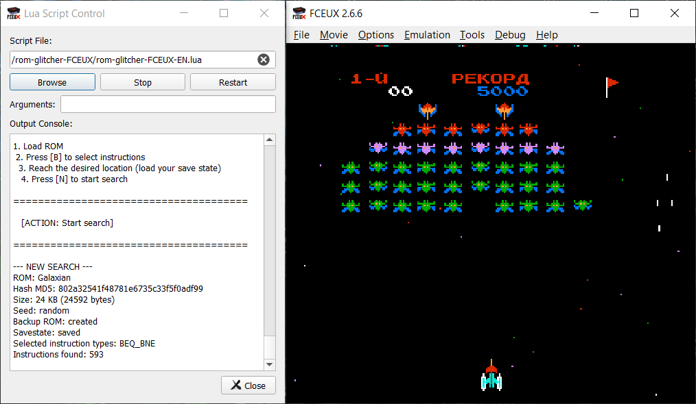

# ROM Glitcher: Instruction Inverter

A tool for casual glitch hunting.

## Discussion and links

- [Discussion on Emuland forum](https://www.emu-land.net/forum/index.php/topic,88982.msg1666909.html#msg1666909)
- [FCEUX emulator repository](https://github.com/TASEmulators/fceux)

## Description

ROM Glitcher: II is an external script for the FCEUX emulator (NES/Famicom/Dendy) that allows you to find and activate hidden game features, change game behavior logic, and unlock "secret" content.

Instead of manually brute-forcing assembly code, Glitcher does it automatically: it searches for potential "points of interest", verifies their correctness, and lets the player toggle effects in real time while playing.

## Who is it for

- ROM hackers and game researchers
- Fans of fun, glitch-based gameplay
- Those who want to find cheat effects and secrets without dealing with assembly, HEX editors, or complex debuggers

## Features

- Interface languages: English, Russian, Spanish, Portuguese, German and Italian.
- Supports FCEUX 2.2.3 and above
- All changes happen in emulator memory; nothing is written to disk (the ROM file is not modified)
- Loading and reloading are fully automatic — no need to switch between windows
- Save a modified ROM
- Available opcodes: AND_EOR, BCC_BCS, BEQ_BNE, BPL_BMI, BVC_BVS, CLC_SEC, CLD_SED, CLI_SEI, INX_DEX, INY_DEY, PHA_PLA, PHP_PLP, ROL_ROR, TAX_TXA, TAY_TYA, TSX_TXS

## How to use

1. Launch the emulator
2. Load the game ROM
3. File -> Load Lua Script
4. Select the script file
5. Click Start
6. Follow the on-screen prompts in the console

## Configuration

Controls and other parameters can be changed in the `rom-glitcher-FCEUX-config.cfg` file (automatically created after the first run).

## Screenshot

